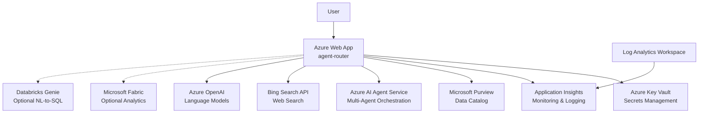

# Azure Deployment Plan for agent-router Project

## **Goal**
Deploy the agent-router Flask application to Azure Web App Service using AZD with Bicep infrastructure as code.

## **Project Information**
**AppName**: agent-router
- **Technology Stack**: Python Flask 3.0.3 web application with React UI frontend  
- **Application Type**: AI-powered query routing service using Microsoft Purview for intent detection
- **Containerization**: Not containerized - will deploy as source code to Azure Web App
- **Dependencies**: 
  - Azure AI Agent Service (required)
  - Microsoft Purview (required) 
  - Bing Search API (required)
  - Azure OpenAI (inferred from MODEL_DEPLOYMENT_NAME)
  - Optional: Microsoft Fabric, Databricks Genie
- **Hosting Recommendation**: Azure Web App Service for Python applications with auto-scaling capability

## **Azure Resources Architecture**
> **Install the mermaid extension in IDE to view the architecture.**

**Data Flow**:
- The Web App receives user queries and routes them through Purview for intent analysis
- Based on intent, the appropriate AI agent is selected (RAG, Genie, or Web Search) via Azure AI Agent Service
- Results are aggregated and returned to the user with proper citations
- All configuration secrets are managed through Azure Key Vault
- Application telemetry flows to Application Insights and Log Analytics

## **Recommended Azure Resources**

**Application Hosting**
- Application: agent-router
  - Hosting Service Type: Azure Web App Service
  - SKU: S1 (Standard) - Provides auto-scaling, custom domains, and staging slots
  - Configuration:
    - Language: python
    - Runtime: Python 3.12
    - Environment Variables: [AZURE_AI_AGENT_ENDPOINT, MODEL_DEPLOYMENT_NAME, PURVIEW_ENDPOINT, BING_CONNECTION_ID, FABRIC_CONNECTION_ID, ENABLE_FABRIC_AGENT, DATABRICKS_INSTANCE, GENIE_SPACE_ID, DATABRICKS_AUTH_TOKEN]

**Supporting Services**
- Application Insights: For application monitoring and performance tracking
- Log Analytics Workspace: Centralized logging for all services  
- Key Vault: Secure storage for connection strings and API keys
- Managed Identity: For secure authentication between Azure services

**Security Configurations**
- User Managed Identity: Assigned to the Web App for secure service-to-service authentication
- Key Vault Access Policy: Managed Identity granted Get/List permissions for secrets
- RBAC Assignments: Managed Identity assigned appropriate roles for Purview and AI services

## **Execution Steps**
> **Below are the steps for Copilot to follow; ask Copilot to update or execute this plan.**

1. **Provision Azure Infrastructure And Deploy the Application**:
    1. Based on following required Azure resources in plan, get the IaC rules from the tool `deploy_iac_rules_get`
    2. Generate IaC (bicep files) for required azure resources based on the plan
    3. Pre-check: use `azd` commands to validate generated Bicep grammar and syntax
    4. Run the AZD command `azd up` to provision the resources and confirm each resource is created or already exists
    5. Check the deployment output to ensure the resources are provisioned successfully
    6. Check the application log with tool `deploy_app_logs_get` to ensure the services are running

2. **Summary**:
    1. Summarize the deployment result and save to '.azure/summary.copilot.md'. It should list all deployment files and brief description of each file, then show a diagram of provisioned Azure resources