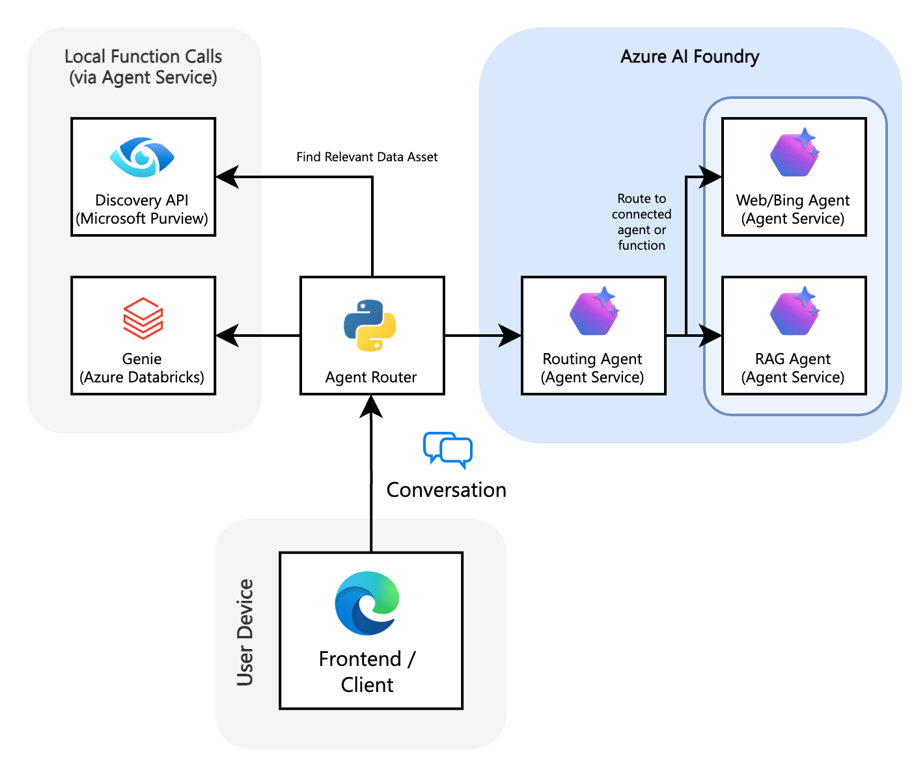

<p align="center">
  <h1 align="center">Agent Router</h1>
</p>
<p align="center">Purview-powered intent routing.</p>
<p align="center">
  <!-- Replace LICENSE badge if different -->
  <a href="LICENSE"></a>
  <!-- Azure AI Foundry feature flag badge -->
  <a href="#"></a>
  <a href="#"></a>
  <a href="#"></a>
  <a href="#"></a>
</p>
 
<p align="center">
</p>


---

## Overview

Purview Agent Router is a sample application that:
- Analyzes each user query via Microsoft Purview search
- Infers intent + available governed data assets
- Dynamically selects and invokes the best specialized agent:
  - Databricks Genie (NL → SQL analytics)
  - RAG Agent (document semantic retrieval)
  - Web Search Agent (Bing) for current / external info
- Returns unified, annotated responses with citations

## Components


<table>
<tr>
<td width="600">

</td>
<td>

| Layer | Tech | Purpose |
|-------|------|---------|
| UI | React | Chat experience |
| API | Flask | REST endpoints |
| Routing | AI Agent Service | Multi-Agent orchestration |
| Discovery | Microsoft Purview | Catalog-driven intent |
| Analytics | Databricks Genie | NL to SQL (Structured) |
| Retrieval | RAG Agent | Document search (Unstructured) |
| External | Bing Search | Real-time / off-catalog queries |
</td>
</tr>
</table>

> ⚠️ **Demo Only**
> 
> This repository is a reference/demo implementation. It is **not hardened for production**: no auth, rate limiting, secure secret handling, or resilience patterns are implemented. Review, extend, and secure before any real-world deployment. The frontend is built using GitHub Spark (Built for rapid prototyping).

## Project Structure

- `backend/` – Flask API, services, configuration, and supporting Python modules
- `frontend/` – React application built with Vite (previously `ui/`)
- `scripts/` – helper scripts for building and running the full stack
- `assets/` – documentation and media used by the README/demo

## Getting Started

### 1. Prerequisites

- Python 3.10+
- Node 22+
- Azure CLI logged in (`az login`)
- Provisioned services (or access):
  - Purview
  - Azure AI Agent Service endpoint
  - Azure OpenAI (model deployment referenced in MODEL_DEPLOYMENT_NAME)
  - Bing Search connection
  - (Optional) Fabric connection
  - (Optional) Databricks Genie space + PAT

### 2. Clone

```bash
git clone https://github.com/aymenfurter/agent-router
cd agent-router
```

### 3. Environment

```bash
cp .env.example .env
# Edit .env with real endpoints / IDs / tokens
```

Minimum required variables:
- AZURE_AI_AGENT_ENDPOINT
- MODEL_DEPLOYMENT_NAME
- PURVIEW_ENDPOINT
- BING_CONNECTION_ID

Optional:
- ENABLE_FABRIC_AGENT=true + FABRIC_CONNECTION_ID
- DATABRICKS_INSTANCE / GENIE_SPACE_ID / DATABRICKS_AUTH_TOKEN

### 4. Build UI + Install Backend

```bash
./scripts/build_all.sh
```

### 5. Run Server

```bash
./scripts/start.sh
```

The start script builds both projects (if needed) and launches the Flask backend, which serves the compiled frontend at http://localhost:5000.

### 6. Try Queries

Examples (also appear as quick buttons):
- What is the cost of Microsoft Encarta?
- What is the maximum taxi fare amount recorded?
- What is the weather like tomorrow in Madrid?

### 7. Manual Mode

Use the gear dropdown near the input:
- Auto (Purview guided)
- RAG / Web / Databricks Genie / Fabric (if enabled)

## Contributing

This repository is a one-off demo/reference drop. It is not an actively maintained project.
- Community PRs are welcome but may not be reviewed or merged in a timely manner (or at all).
- There is no SLA for issues, discussions, or security responses beyond the standard Microsoft reporting process.
- Large refactors, feature requests, or architectural changes are unlikely to be accepted.
- The project may be archived or updated without notice.
- If you fork it, treat it as a starting point and assume responsibility for hardening and maintenance.

By opening a PR you agree it may be closed without detailed feedback.

## License

This project is licensed under the MIT License - see LICENSE. The User Interface has seperate license terms. 
